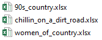

```{r setup, include=FALSE}
knitr::opts_chunk$set(collapse = TRUE)
```


### Example

Let's say you have multiple files that you want to load into R and include the folder and file name in the final tibble.  In this example, we have Spotify playlist data that was downloaded using [Exportify](<https://rawgit.com/watsonbox/exportify/master/exportify.html>).  Each playlist was previously converted to .xlsx files and placed into the appropriate genre's folder (see below).


<br>

Each playlist folder includes multiple .xlsx playlist files.  The example below shows the contents inside the Country genre folder.



<br>

### Load Libraries

The tidyverse and readxl libraries are the only ones required for this quick tutorial.

```{r, echo=TRUE, results="hide", warning=FALSE, error=FALSE, message=FALSE}
library(tidyverse)
library(readxl)
```

<br>

### View Files in Each Folder

First, we can create a function that lists the .xlsx files for each genre folder. The function utilises the **base::list.files()** that will list each file under a particular folder.

```{r, echo=TRUE}

list_files_in_folder <- function(genre) {
    
    list.files(path = str_c("Data_Sources/2020_05_14_Loading_Mult_Files/Genres/", genre),
                          pattern = "*.xlsx", 
                          full.names = T) %>% 
    tibble::enframe()
    
}
```

<br>

For example, if we want to view all the files in the Country genre folder, we can easily pass "Country" into the function.

```{r}
list_files_in_folder("Country")
```

<br>

Next, we will create a genre list that includes all three genres.  This step will allow us to map the **list_files_in_folder** function to multiple genre folders later on.
```{r}
genre_list <- c("Country", "Hip_Hop", "Rock")
```

<br>

This list is mapped into the function listed below.  The final result includes a tibble with all .csv files in all the folders we specified above.

```{r}
playlist_tbl <- genre_list %>% 
  map_df(list_files_in_folder)
```

<br>

The value column is extracted from the tibble above and transformed into a list.

```{r}
playlist_list <- playlist_tbl %>%
  select(value) %>%
  as.list()

playlist_list$value
```

<br>

The **playlist_list$value** can then be mapped into the function below which will read each .csv file and add the file name into a tibble.

```{r results="hide", warning=FALSE, error=FALSE, message=FALSE}
song_tbl <- playlist_list$value %>% 
    
    map_df(function(add_file_name)
        
        read_excel(add_file_name) %>%
            
            mutate(playlist_name = gsub(".xlsx", 
                                        "", 
                                        basename(add_file_name))) %>%
            mutate(filename = add_file_name)
    )
```

<br>

```{r}
song_tbl %>% 
  select(-`<U+FEFF>Spotify URI`) %>%
  glimpse()
```

<br>

```{r}
song_tidy_tbl <- song_tbl %>% 
            separate(col    = filename, 
                     into   = c("Folder_01", "Folder_02", "Folder_03", "Genre", "Playlist"),
                     sep    = "/",
                     remove = FALSE)
```


```{r}
song_tidy_tbl %>% glimpse()
```

